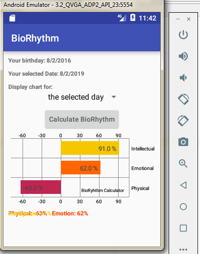
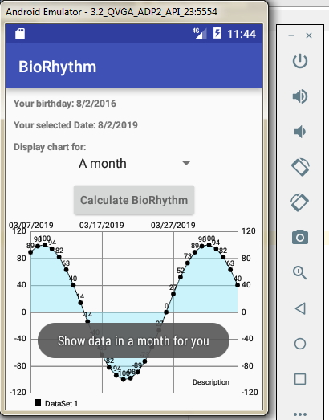

# BioRhythm
BioRhythmCalculator

This project is my exercises about developing app on Android platform.The highlights through this project: 
- Used MPAndroidChart library to render linechart & barchart
- Used Notification module to schedule sending notification  
- Used with layout elements: spinner, button, textview, graph, DatePickerDialog
- Used BioRhythm algorithm: https://en.wikipedia.org/wiki/Biorhythm  

ScreenShots: 

